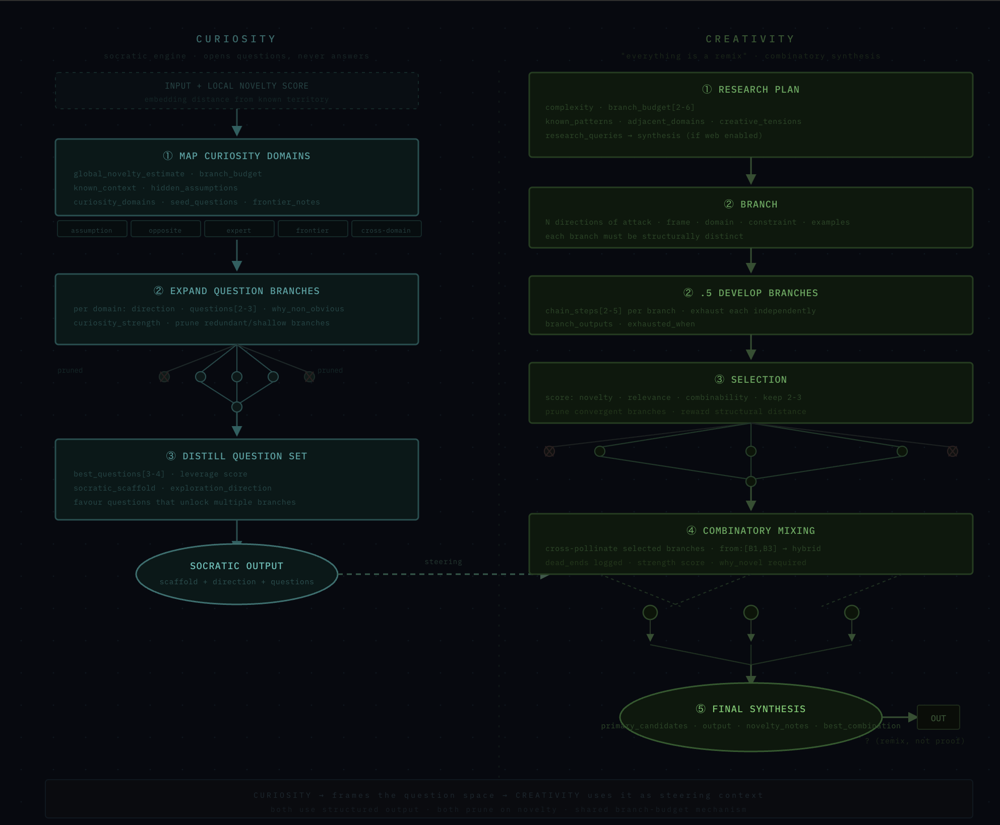

# Gemma 4 Creative Reasoning Fine-Tune

**[Gemma 4 Good Hackathon](https://www.kaggle.com/competitions/gemma-4-good-hackathon/overview)** | Kaggle x Google DeepMind



## What this project is

This is a fine-tuning experiment that gives Gemma 4 a **cognitive architecture for creative thinking**.

The idea is not to make the model "try harder" or produce longer answers. It is to give it a structured internal process that mirrors how creative cognition actually works: questioning assumptions, exploring structurally different directions, recombining the best parts, and critically evaluating the result before committing to it.

The architecture has two streams that work together:

**Curiosity** is a socratic engine. It never answers. It maps the problem space, surfaces hidden assumptions, identifies unexplored domains, expands question branches, prunes the weak ones, and distills the strongest questions into a steering signal for creativity.

**Creativity** receives that steering signal and uses it. It builds a research plan, generates structurally distinct branches, develops each one independently, scores and selects the strongest, cross-pollinates them into hybrid ideas, and synthesizes a final output.

A **Critic** then evaluates the result. If the output is not genuinely novel and relevant, the critic sends feedback back to curiosity and the loop runs again.

This is not prompt engineering. It is a reasoning system. The pipeline runs each cognitive step as a separate LLM call with its own prompt pair, schema, and validation. The resulting reasoning traces are then used as SFT training data so the model internalizes the architecture into its weights.

## Why it matters

Standard LLMs do not lack knowledge. They lack process.

When given an open-ended creative task, most models skip straight to generation. They do not question the framing. They do not explore alternative directions. They do not evaluate whether their output is actually novel or just fluent.

This project implements the missing process as a trainable architecture:

1. **Map** the question space before generating anything
2. **Branch** into structurally distinct directions
3. **Develop** each branch independently
4. **Select** based on novelty, relevance, and combinability
5. **Mix** the best branches into hybrid ideas
6. **Synthesize** the final candidates
7. **Critique** and loop if needed

Each of these steps mirrors a real phase of creative cognition. Together they form a complete creative thinking process that the model can learn.

## Architecture

The advanced pipeline executes 11 distinct stages per iteration:

```text
CURIOSITY STREAM                    CREATIVITY STREAM

1. Map curiosity domains
2. Expand question branches
3. Distill question set
4. Socratic output -----steering---> 5. Research plan
                                     6. Branch
                                     7. Develop each branch
                                     8. Selection + pruning
                                     9. Combinatory mixing
                                    10. Final synthesis
                                    11. Critic
```

Curiosity frames the question space. Creativity uses it as active steering context throughout every stage.

Both streams use structured JSON output, per-stage validation, branch-budget mechanisms, and novelty-driven pruning.

## Training approach

**All synthetic training data is generated by Gemma 4 itself.**

No teacher model. No distillation. The hypothesis is that creative reasoning capacity already exists latently in the base model. Structured prompting surfaces it. Fine-tuning internalizes it.

The data pipeline:

```text
seed prompts -> pipeline runs -> structured traces -> SFT format -> train/eval/test -> fine-tune -> evaluate
```

The evaluation compares three tiers:

| Tier | Setup |
|---|---|
| 1 | Vanilla Gemma 4 |
| 2 | Gemma 4 + pipeline scaffolding |
| 3 | Fine-tuned Gemma 4 (no scaffolding) |

Tier 3 > Tier 2 > Tier 1 = the architecture transferred into the weights.

## Repo structure

```
src/
  I_pipeline/       prompts, schemas, runners (simple + advanced)
  II_dataGen/       dataset generation, SFT formatting, train/eval/test splits
  III_fineTune/     config-driven training workflow, local preflight, cloud handoff
  IV_inference/     Gemma 4 wrappers (HF + Ollama), 3-tier evaluation
  V_utility/        markdown export, helpers
  app.py            Gradio demo UI

data/
  input/            seed prompts, SFT datasets, train/eval/test splits
  output/           pipeline runs, eval results, model artifacts

docs/               architecture diagram, project notes, references
```

## Quickstart

```bash
python3.11 -m venv .venv && source .venv/bin/activate
pip install -r requirements.txt

python src/I_pipeline/runner.py            # simple pipeline
python src/I_pipeline/runner_advanced.py   # full staged pipeline
python src/II_dataGen/generate.py          # generate training data
python src/II_dataGen/format_sft.py        # convert to SFT format
python src/III_fineTune/sft_train.py       # preflight + training config
python src/IV_inference/evaluate.py        # 3-tier evaluation
python src/app.py                          # Gradio demo
```

All scripts are interactive terminal UIs. No CLI args needed.

## Competition framing

**Track:** Education

**Thesis:** Creative and critical thinking are not personality traits. They are cognitive architectures that can be learned. This project teaches Gemma 4 a structured creative reasoning process, then fine-tunes it so the model thinks this way natively, without scaffolding.

**Impact:** Students and creators in under-resourced environments lack access to Socratic mentors and creative collaborators. A model that genuinely questions, explores, and critiques before answering can serve as both.

**Differentiator:** Training on full multi-stage reasoning traces, not input/output pairs. The model learns the *process* of creative thinking, not just its outputs.
