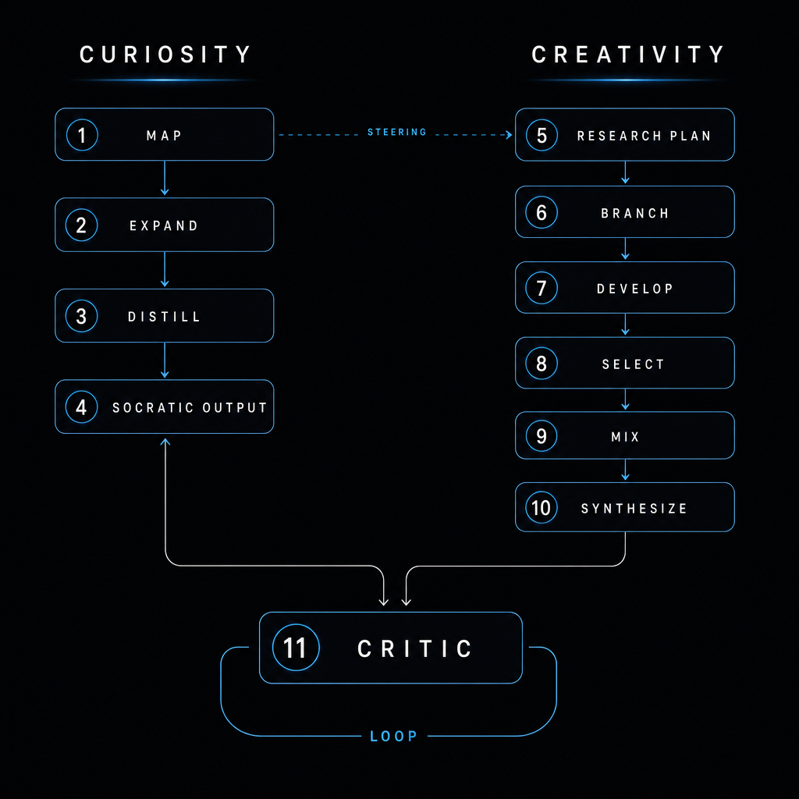
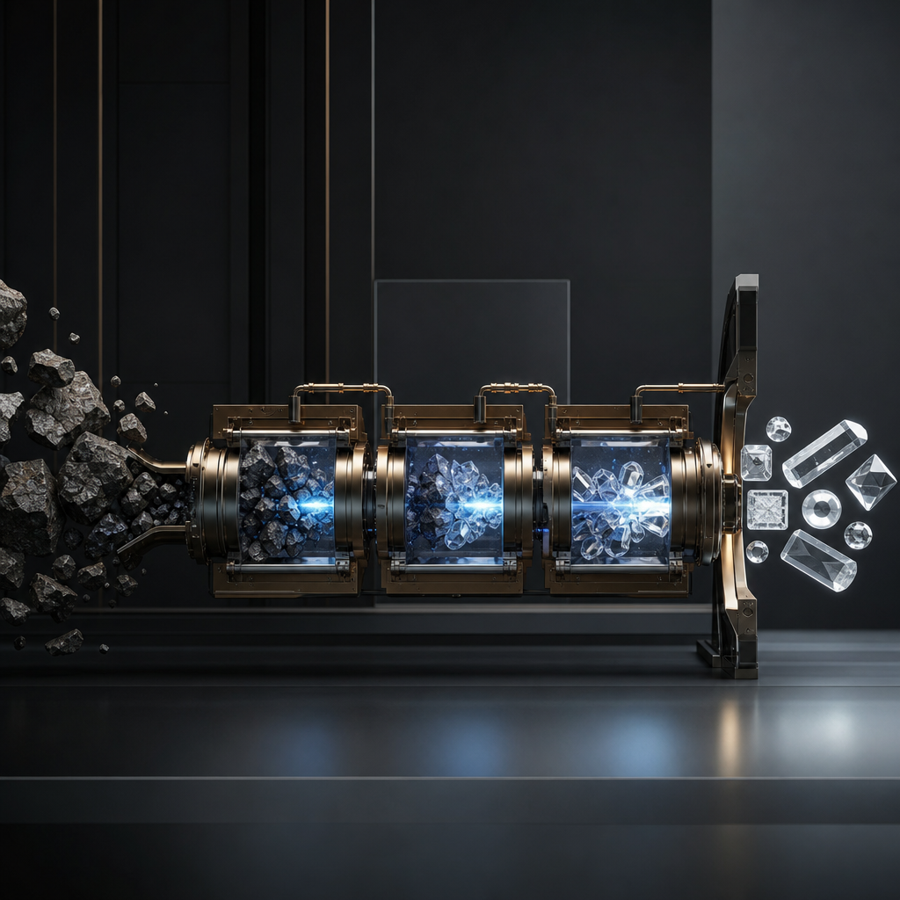
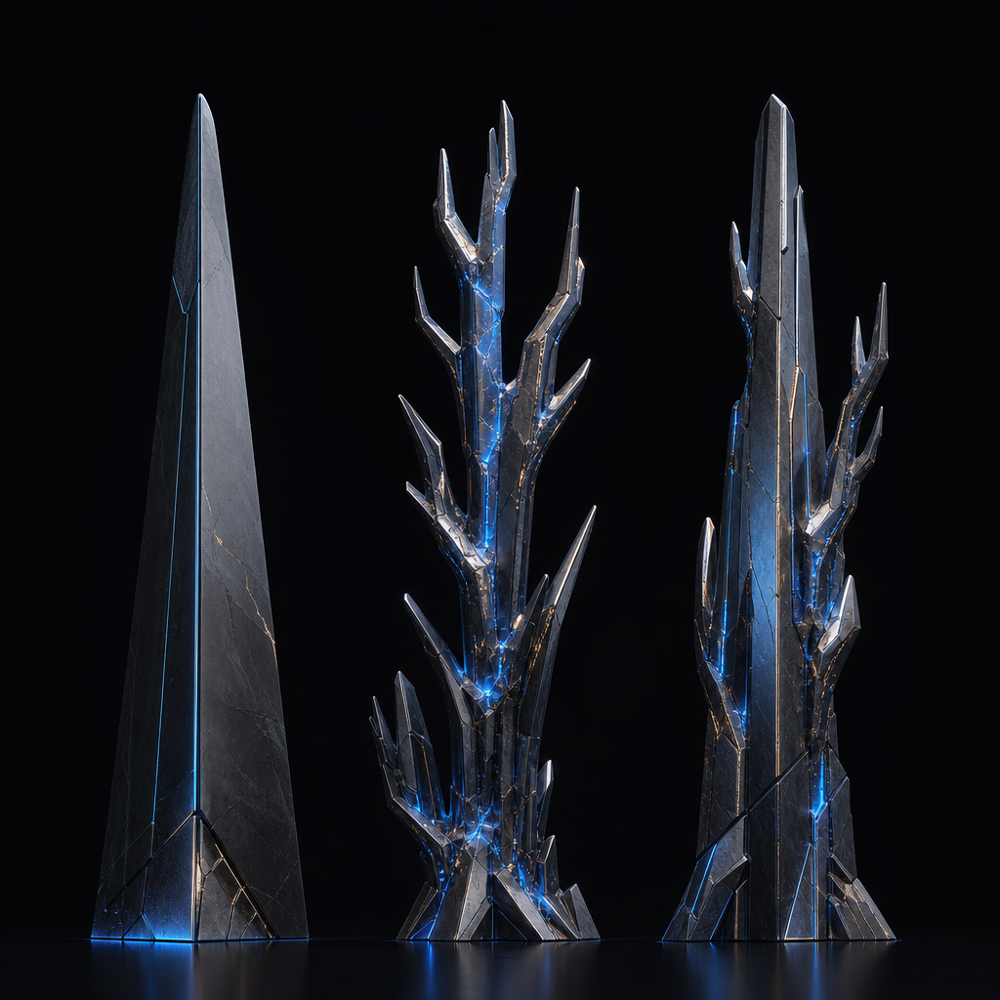
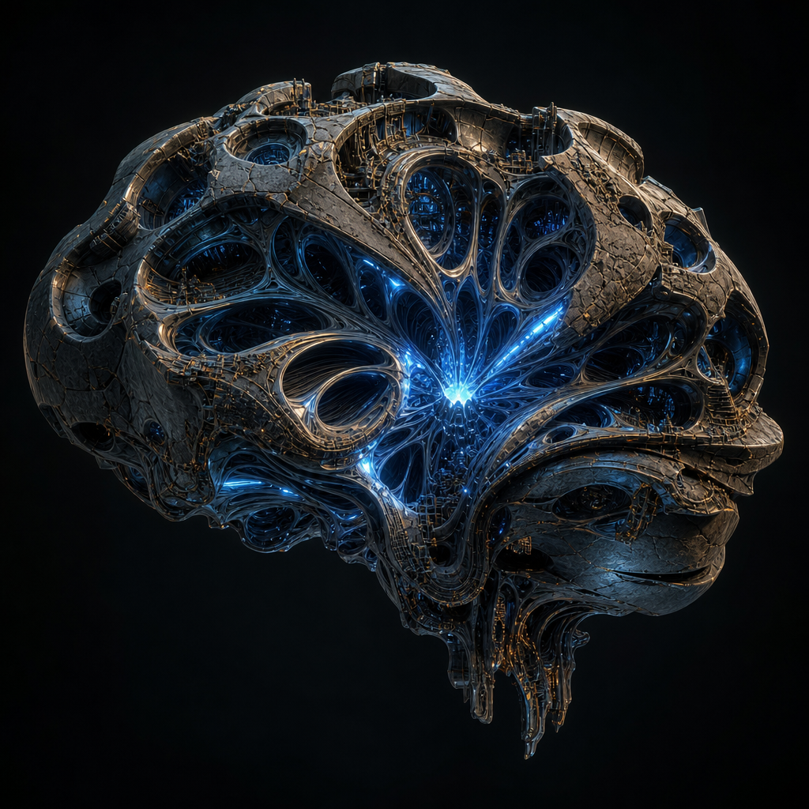

# Gemma 4 Creative Reasoning Fine-Tune

**[Gemma 4 Good Hackathon](https://www.kaggle.com/competitions/gemma-4-good-hackathon/overview)** | Kaggle × Google DeepMind | Education Track

Teaching Gemma 4 to *think* creatively, not just *answer* creatively.

## The idea

Creativity is where current LLMs are weakest. Outputs are bounded by training data and stochastic sampling, and in five years of testing, no model has reliably produced a truly original idea — not even for something as small as naming.

Reverse-engineering my own creative process, it breaks down to a two-stream loop: **curiosity** opens the question space, **creativity** branches and recombines, a **critic** decides when it's good enough. Eleven stages in total, each a separate LLM call with its own schema and validation.

This project implements that loop, generates reasoning traces from Gemma 4 running through it, then fine-tunes Gemma 4 on those traces so part of the process becomes native to the weights.

## Architecture



- **Curiosity** is a Socratic engine. Never answers. Maps the problem across five lenses, expands question branches, prunes the weak ones, distils the strongest into a steering signal.
- **Creativity** receives that signal. Builds a research plan, generates structurally distinct branches, develops each independently, selects on novelty, cross-pollinates the survivors into hybrids.
- **Critic** scores every candidate on novelty and relevance. On FAIL, sends targeted feedback back to both streams and the loop runs again.

Combinatorial mixing is the heart of it. The same way DNA recombines from two parents into something genuinely new, branches are remixed across structural distances to produce ideas unreachable from any single chain of thought.

## Training data

| Stage | Count |
|---|---|
| Raw reasoning traces generated | 5,000 |
| SFT examples (train / eval / test) | 4,771 (4,293 / 238 / 240) |
| Self-distilled from Gemma 4 (pure) | ~300 |
| Scaled via external API (same prompts) | the remainder |
| Domains | 8 |



The original intent was pure self-distillation — Gemma 4 generating its own traces, no teacher. ~300 examples trained cleanly but didn't shift behavior. To reach a volume where fine-tuning shows a measurable effect, the same 11-stage prompts were re-run through a third-party API model. The architecture and prompts stayed identical; only the model behind each call changed.

The claim still holds: the cognitive architecture is recoverable from Gemma 4 — internalising it is what needs scale.

## Training

| | |
|---|---|
| Base model | `google/gemma-4-E4B-it` (8.07B) |
| Method | LoRA via Unsloth |
| Rank / alpha / dropout | 16 / 32 / 0.05 |
| Trainable params | 73.4M (0.91% of full model) |
| Epochs | 2 |
| Steps | 2,148 |
| Hardware | Kaggle Tesla T4 (16 GB, FP16) |
| Runtime | ~4.4 h |
| Final train loss | 0.56 |

## Findings



The full analysis is in [`WRITEUP.md`](WRITEUP.md). Summary:

- **Tier 2 (pipeline at runtime) works.** Outputs are clearly more structured, branched, and self-critical than vanilla.
- **Tier 3 (fine-tuned, no scaffolding) shows soft transfer.** The tuned model more often asks clarifying questions, uses tighter idea-set groupings, and stays more constraint-aware. It does not, however, spontaneously emit the verbatim trace format at default sampling.
- **The format is in the weights.** A light format hint in the prompt unlocks the full `## Iteration / ### Curiosity / ### Creativity / ## Final Output` structure cleanly. The base model's stronger instruct-tuning prior is what suppresses it in free generation.
- **Temperature sweet spot: 0.6–0.8.** Below 0.5 collapses to baseline. Above 1.0 becomes noise. The 0.6–0.8 range expands sampling enough to benefit the branch-and-select stages without breaking coherence.
- **Honest limit:** at 2× sampling scale the adapter degenerates into repetition. All reported results are at 1×.

## Why it matters



Creativity is the most impactful unsolved problem in LLM development. Crack it and self-improvement follows — the difference between a model that recombines what it knows and one that produces something genuinely new. Winner-takes-all direction.

For education specifically: a model that questions, branches, and critiques before answering teaches **how to think**, not just **what to accept**. That capability matters most in places where Socratic mentors are scarce.

## Repo structure

```text
src/
  I_pipeline/       prompts, schemas, runners (simple + 11-stage advanced)
  II_dataGen/       dataset generation, SFT formatting, splits
  III_fineTune/     Unsloth LoRA workflow, Kaggle handoff, training report
  IV_inference/     Gemma 4 wrappers (HF + Ollama), 3-tier eval, diagnostic
  V_utility/        markdown export, helpers
  app.py            Gradio demo UI

data/
  input/            seed prompts, SFT dataset, train/eval/test splits
  output/           pipeline runs, eval results, models, visuals

docs/               architecture diagram, project document, working notes
presentation/       hackathon slide deck (vanilla HTML, SVG charts)

README.md           this file
WRITEUP.md          full submission write-up
VIDEO_SCRIPT.md     3-minute demo video script
```

## Quickstart

```bash
python3.11 -m venv .venv && source .venv/bin/activate
pip install -r requirements.txt

python src/I_pipeline/runner.py            # simple pipeline (3 stages)
python src/I_pipeline/runner_advanced.py   # full 11-stage pipeline
python src/II_dataGen/generate.py          # generate training traces
python src/II_dataGen/format_sft.py        # convert to SFT JSONL
python src/III_fineTune/sft_train.py       # preflight + run config
python src/IV_inference/evaluate.py        # 3-tier evaluation
python src/IV_inference/honest_compare.py  # vanilla vs tuned, interactive
python src/app.py                          # Gradio demo
```

All scripts are interactive terminal UIs. No CLI flags.

## License

MIT. See `LICENSE`.
